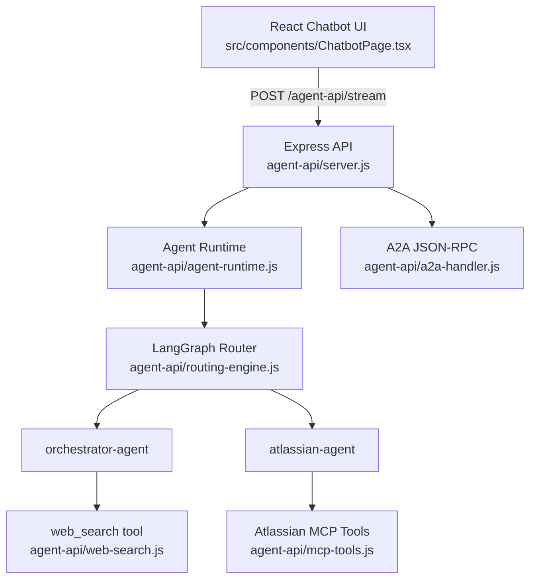
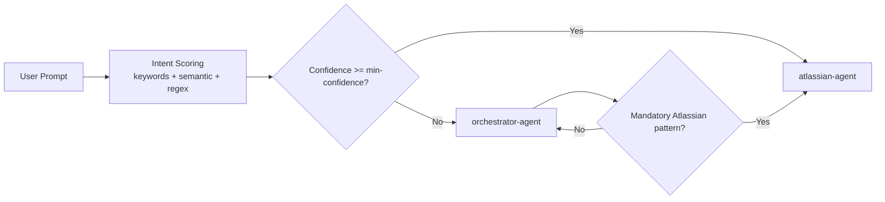
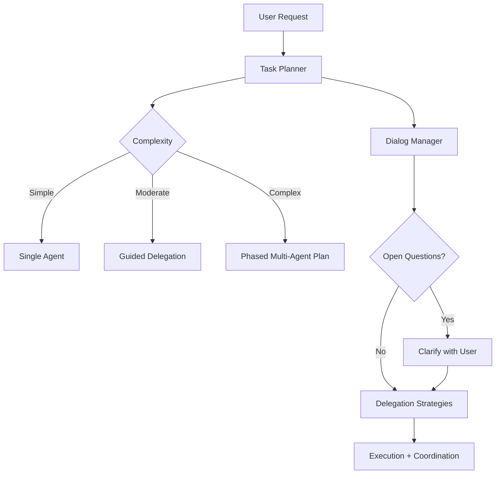
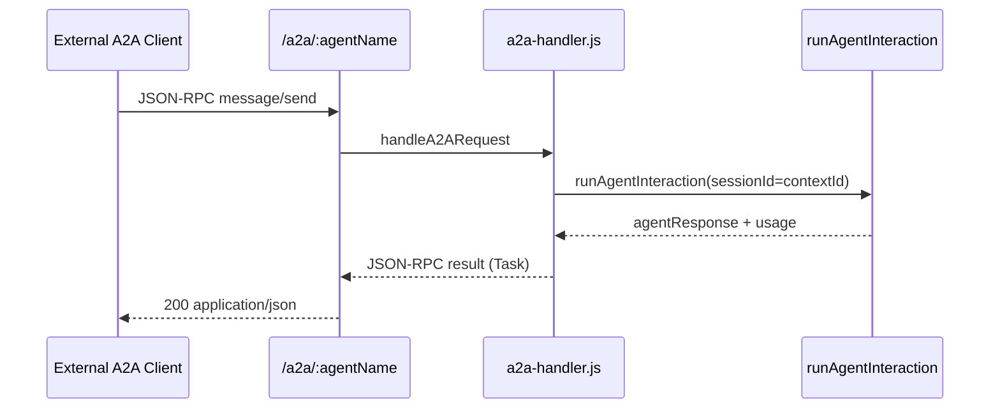

# AI Education Guide: Multi-Agent Implementation

## Table of Contents

- [AI Education Guide: Multi-Agent Implementation](#ai-education-guide-multi-agent-implementation)
  - [Table of Contents](#table-of-contents)
  - [Purpose](#purpose)
  - [System At A Glance](#system-at-a-glance)
  - [1) Communication Between Chatbot and Orchestrator](#1-communication-between-chatbot-and-orchestrator)
  - [2) Routing Logic (Orchestrator -> Specialist)](#2-routing-logic-orchestrator---specialist)
  - [3) Communication Between Agents](#3-communication-between-agents)
  - [4) Context and Memory Handling](#4-context-and-memory-handling)
  - [5) Model-Agnostic Selection With LangChain](#5-model-agnostic-selection-with-langchain)
  - [6) Multi-Agent Patterns Implemented Here](#6-multi-agent-patterns-implemented-here)
  - [7) A2A (Agent-to-Agent Protocol)](#7-a2a-agent-to-agent-protocol)
  - [8) End-To-End Execution Example](#8-end-to-end-execution-example)
  - [9) What To Study Next In This Repository](#9-what-to-study-next-in-this-repository)

## Purpose

This guide explains the key AI implementation pieces in this repository so you can learn how a practical multi-agent architecture is built.

The focus is on:

- Chatbot <-> orchestrator communication
- Orchestrator <-> specialist agent routing and delegation
- Context propagation and session history
- Model-agnostic execution through LangChain + OpenRouter
- Multi-agent orchestration patterns
- A2A interoperability endpoints

## System At A Glance



## 1) Communication Between Chatbot and Orchestrator

The UI sends the latest user prompt with `sessionId` and `model` to `/agent-api/stream`.
The backend emits progressive events (`status`, `log`, `final_delta`) and then a `final` payload.

Code sample from `src/components/ChatbotPage.tsx`:

```ts
streamResponse = await fetch(streamUrl, {
  method: "POST",
  headers,
  body: JSON.stringify({
    sessionId,
    userPrompt: lastUserMessage?.content ?? "",
    model: selectedModel,
  }),
});
```

Code sample from `agent-api/server.js`:

```js
const data = await runAgentInteraction({
  sessionId,
  userPrompt,
  model,
  onProgress: (progressEvent) => {
    sendEvent("progress", {
      sessionId,
      timestamp: new Date().toISOString(),
      ...progressEvent,
    });
  },
});
```

Why this matters:

- The UI gets transparent execution logs while the model/tool loop runs.
- The runtime remains backend-authoritative for routing and tool calling.
- `traceparent` and `x-trace-id` are propagated for observability.

## 2) Routing Logic (Orchestrator -> Specialist)

Routing is built as a LangGraph state machine in `agent-api/routing-engine.js`:

```js
const graph = new StateGraph(routingGraphState)
  .addNode("intent_router", (state) => {
    const intent = computeAtlassianIntent(routingConfig, state.userPrompt);
    return { ...intent };
  })
  .addNode("select_agent", (state) => {
    const selectedAgentName = state.requiresAtlassian
      ? routingConfig.atlassianName
      : routingConfig.orchestratorName;
    // ... select prompt + MCP config
  })
  .addEdge(START, "intent_router")
  .addEdge("intent_router", "select_agent")
  .addEdge("select_agent", END);
```

Then `agent-api/agent-runtime.js` adds enforcement for mandatory Atlassian intents:

```js
const enforceAtlassian = enforceAtlassianDelegation(userPrompt, selectedAgentName, routingConfig);
if (enforceAtlassian.shouldDelegateTo) {
  selectedAgentName = enforceAtlassian.shouldDelegateTo;
  routeReason = "enforcement-atlassian-mandatory";
  routeConfidence = 0.95;
}
```

Routing decision flow:



## 3) Communication Between Agents

In this repository, "between agents" is mainly orchestrated handover inside one runtime process:

- Orchestrator selects target specialist.
- Runtime switches active toolset/system prompt.
- Execution logs include `agent` and `target` metadata.

Code sample from `agent-api/agent-runtime.js`:

```js
addLog(
  "agent",
  `Delegated request from ${delegatedBy} to ${selectedAgentName}.`,
  { delegatedBy, selectedAgentName },
  null,
  "orchestration",
  { agent: delegatedBy, target: selectedAgentName },
);
```

Specialist communication style:

- `orchestrator-agent` typically uses `web_search` tool.
- `atlassian-agent` receives dynamically discovered MCP tools.

## 4) Context and Memory Handling

There are two key context layers.

1. Session conversation history in runtime memory.
2. System context added per request (routing decision, tool policy, optional preloaded web context, MCP config).

Code sample from `agent-api/agent-runtime.js`:

```js
const previous = sessions.get(sessionId) || [];

const messages = [
  new SystemMessage(`${selectedSystemPrompt}\nCurrent date: ...`),
  ...(hasMcpConfig ? [new SystemMessage("MCP server configuration ...")] : []),
  ...(autoWebContext ? [new SystemMessage("Preloaded web lookup results ...")] : []),
  ...previous,
  new HumanMessage(userPrompt),
];
```

The runtime enforces tool-first behavior (avoid "I would run X" responses) and can retry model output to force real tool execution.

## 5) Model-Agnostic Selection With LangChain

Model selection is configurable at 3 levels:

- `src/resources/agent-config.json`: default model + available models + per-agent LLM config.
- UI: user picks `selectedModel`.
- Runtime: model override applies on top of selected agent LLM config.

Code sample from `agent-api/agent-runtime.js`:

```js
const finalLlmConfig = model && typeof model === "string" && model.trim().length > 0
  ? { ...selectedLlmConfig, model: model.trim() }
  : selectedLlmConfig;

const modelInstance = buildModel(selectedAgentTools, finalLlmConfig);
```

LangChain binding (same runtime code path, different model IDs):

```js
return new ChatOpenAI({
  model: llmConfig.model,
  temperature: llmConfig.temperature,
  apiKey: process.env.OPENROUTER_API_KEY,
  configuration: { baseURL: llmConfig.baseUrl },
}).bindTools(tools);
```

Why this is model-agnostic in practice:

- You swap model IDs in config or UI without changing orchestration code.
- Tool-calling loop and routing remain stable across model providers served by OpenRouter.

## 6) Multi-Agent Patterns Implemented Here

The repository includes modular orchestration helpers:

- `agent-api/task-planner.js`: complexity, category, subtasks, open questions.
- `agent-api/dialog-manager.js`: clarification dialog generation + follow-ups.
- `agent-api/delegation-strategies.js`: agent selection and coordination plans.

Code sample from `agent-api/task-planner.js`:

```js
export function planTask(userRequest) {
  return {
    original_request: userRequest,
    complexity: determineComplexity(userRequest),
    category: categorizeTask(userRequest),
    subtasks: breakDownTask(userRequest),
    open_questions: identifyOpenQuestions(userRequest),
    recommended_agents: recommendAgents(userRequest),
    approach: selectApproach(userRequest),
  };
}
```

Code sample from `agent-api/delegation-strategies.js`:

```js
export function determineAgent(taskPlan) {
  if (taskPlan.complexity === "simple") {
    const agent = findBestAgent(taskPlan.category);
    return [{ agent, role: "primary", subtasks: taskPlan.subtasks }];
  }
  // moderate/complex expands to multi-agent and phased coordination
}
```

Conceptual pattern:



## 7) A2A (Agent-to-Agent Protocol)

This repo exposes A2A endpoints in `agent-api/a2a-handler.js` and `agent-api/server.js`.

Supported endpoints and methods:

- `GET /a2a/:agentName/.well-known/agent.json`: agent card
- `POST /a2a/:agentName`: JSON-RPC (`message/send`, `tasks/get`, `tasks/cancel`)

Code sample from `agent-api/a2a-handler.js`:

```js
switch (method) {
  case "message/send":
    outcome = await handleMessageSend(params, agentName);
    break;
  case "tasks/get":
    outcome = handleTasksGet(params);
    break;
  case "tasks/cancel":
    outcome = handleTasksCancel(params);
    break;
}
```

A2A interaction map:



## 8) End-To-End Execution Example

Example prompt:

"Find Jira issues assigned to me and summarize blockers."

Execution path:

1. UI sends stream request with `sessionId` + selected model.
2. Runtime routes to `atlassian-agent` by keyword/regex/semantic confidence.
3. MCP tool schemas are discovered dynamically.
4. Model invokes tools in the runtime loop.
5. Tool results are fed back into model as `ToolMessage`.
6. Final response streams to UI with logs and token usage metadata.

Tool loop sample from `agent-api/agent-runtime.js`:

```js
if (Array.isArray(aiMessage.tool_calls) && aiMessage.tool_calls.length > 0) {
  for (const call of aiMessage.tool_calls) {
    let result;
    if (call.name === "web_search") {
      result = await runWebSearch(toolQuery, toolApis);
    } else if (mcpToolExecutors[call.name]) {
      result = await mcpToolExecutors[call.name](call.args || {});
    }

    messages.push(new ToolMessage({ tool_call_id: call.id, content: String(result) }));
  }
  continue;
}
```

## 9) What To Study Next In This Repository

To deepen multi-agent understanding, read these in order:

1. `agent-api/routing-config.js`
2. `agent-api/routing-engine.js`
3. `agent-api/agent-runtime.js`
4. `agent-api/mcp-tools.js`
5. `agent-api/a2a-handler.js`
6. `documentation/orchestration.md`
7. `documentation/sdlm-orchestration.md`

This sequence shows the progression from static config -> intent routing -> runtime execution loop -> tool integration -> interoperable agent protocol.