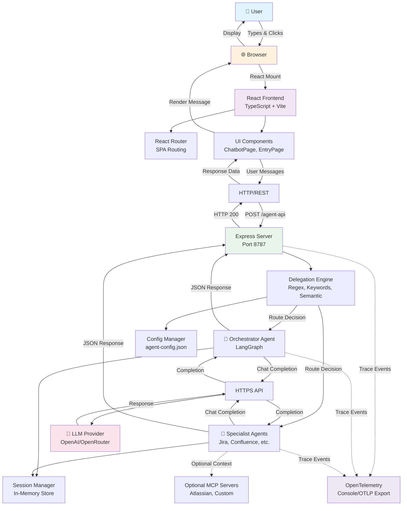
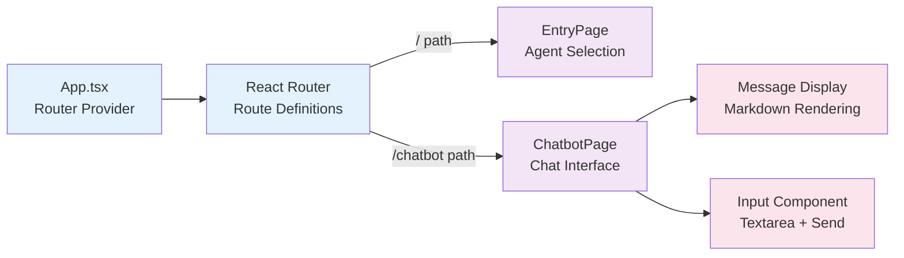
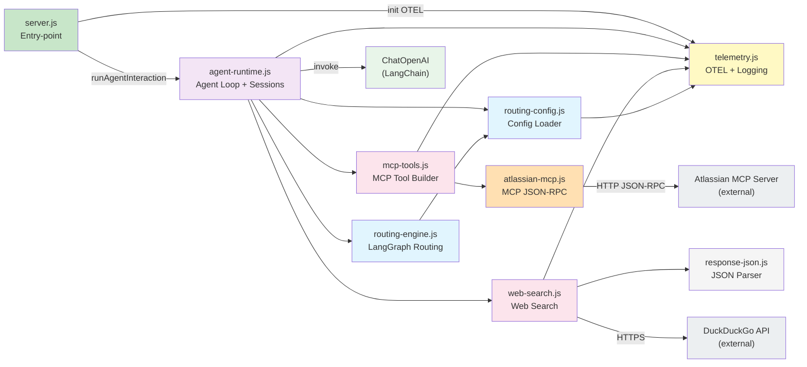
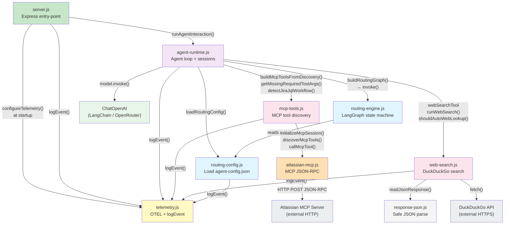
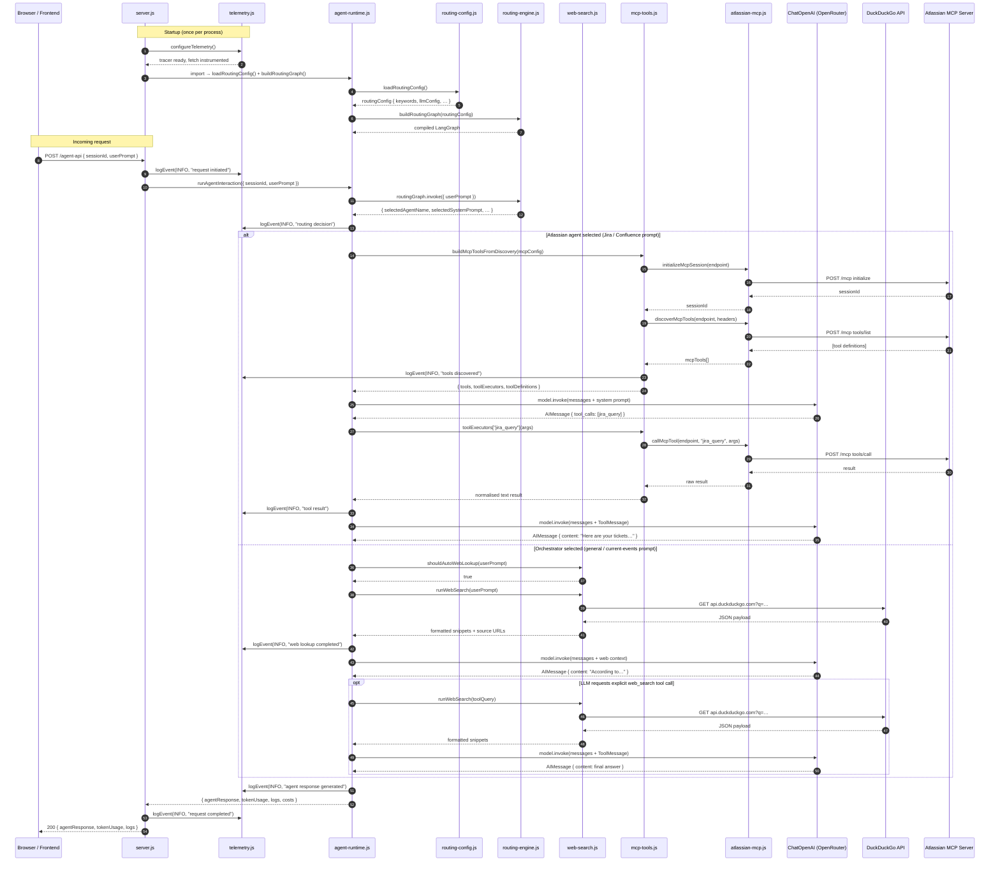
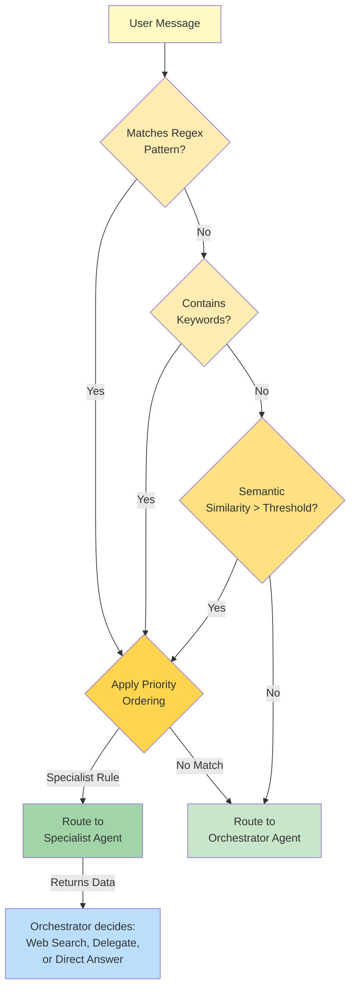
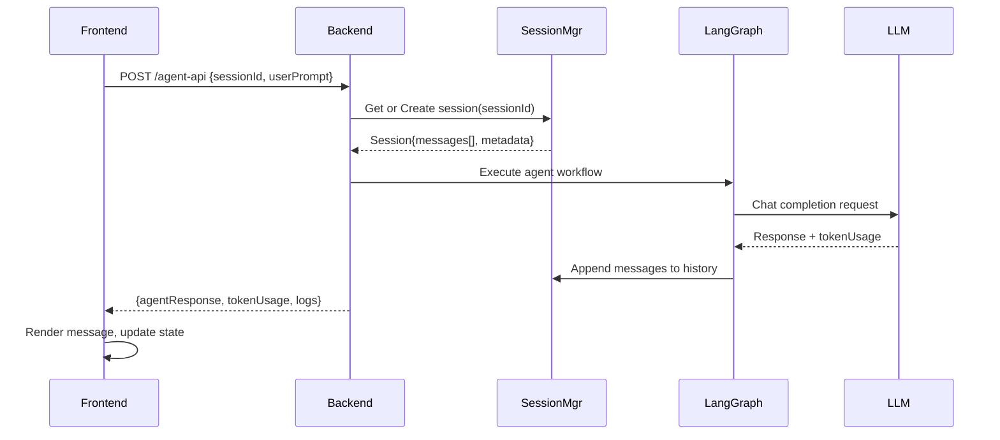
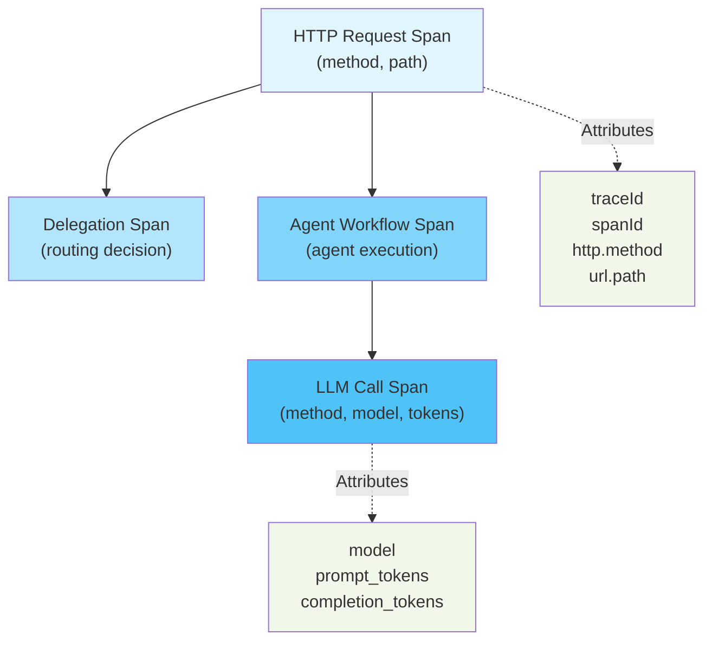

# Architecture

This document describes the system architecture of the AI Copilot project, including layers, components, and data flows.

## Table of Contents

1. [System Overview](#system-overview)
2. [Architecture Layers](#architecture-layers)
3. [Component Diagram](#component-diagram)
4. [Backend Module Interactions](#backend-module-interactions)
5. [Agent Routing Flow](#agent-routing-flow)
6. [Session Management](#session-management)
7. [Observability Architecture](#observability-architecture)
8. [Deployment Considerations](#deployment-considerations)

## System Overview

AI Copilot is a distributed system consisting of:

- **Frontend**: React SPA providing the user interface
- **Backend API**: Express server orchestrating multi-agent conversations
- **LLM Provider**: OpenAI/OpenRouter for language model inference
- **Optional MCP Servers**: External services integrated via Model Context Protocol

The system supports intelligent task routing, delegating specialized queries to appropriate agents while maintaining a unified chat interface.

## Architecture Layers

### Layer Diagram



### Layer Details

#### 1. Presentation Layer (Frontend)

**Technology**: React 19, TypeScript, Vite

**Responsibilities**:
- Render user interface (chat messages, input fields, agent selector)
- Manage UI state and animations
- Route between pages (EntryPage, ChatbotPage, etc.)
- Handle user input and validation
- Display responses with formatting (markdown, syntax highlighting)

**Key Components**:
- `App.tsx`: Root component with routing context
- `ChatbotPage.tsx`: Main chat interface with message list and input
- `EntryPage.tsx`: Agent selection screen
- `index.css`: Global styles and CSS variables

#### 2. API Layer (Backend)

**Technology**: Express.js, Node.js — decomposed into focused modules

| Module | Responsibility |
|---|---|
| `server.js` | Express app, CORS/JSON middleware, route handlers, server start |
| `telemetry.js` | OTEL provider setup, `logEvent()`, global fetch instrumentation |
| `routing-config.js` | Load `agent-config.json`, resolve `$ENV_VAR` references, typed config |
| `routing-engine.js` | LangGraph state machine: intent detection → agent selection |
| `agent-runtime.js` | Session store, token usage helpers, full agent interaction loop |
| `mcp-tools.js` | MCP tool discovery, LangChain wrappers, Jira JQL workflow detection |
| `web-search.js` | DuckDuckGo instant-answer search, `webSearchTool`, auto-lookup heuristic |
| `atlassian-mcp.js` | Low-level MCP JSON-RPC (`initialize`, `tools/list`, `tools/call`) |
| `response-json.js` | Safe async JSON body parser |

**Key Endpoints**:
- `GET /agent-api/health`: Health check
- `POST /agent-api`: Chat completion request

#### 3. Orchestration Layer (LangGraph)

**Technology**: LangGraph (state machine framework)

**Responsibilities**:
- Evaluate delegation rules based on user input
- Maintain conversation state and message history
- Coordinate between orchestrator and specialist agents
- Manage agent-specific configurations (prompts, MCP connections)

**Routing Logic**:
1. Parse user input with regex patterns (highest priority)
2. Match against keywords (deterministic)
3. Fall back to semantic similarity (LLM-based)
4. Apply confidence threshold and priority ordering

#### 4. Agent Layer

**Agents**:
- **Orchestrator Agent**: Default agent handling general topics, web search requests, and task delegation
- **Specialist Agents**: Domain-specific agents (e.g., Atlassian agent for Jira/Confluence)

**Responsibilities**:
- Execute system prompt for their domain
- Invoke LLM with appropriate context
- Process tool calls (via MCP if applicable)
- Return structured responses

**Orchestrator Agent Behavior**:
When the Orchestrator Agent receives a request it cannot resolve directly, it:
1. **Identifies the topic**: Analyzes if the request matches a specialist domain
2. **Delegates or Performs**:
   - **Delegates to Atlassian Agent**: If request is about Jira tickets, Confluence pages, or Atlassian workflows
   - **Performs Web Search**: If request requires current information not in training data
   - **Responds Directly**: For general knowledge questions

**Specialist Agents**:
- **Atlassian Agent**: Handles Jira and Confluence queries by connecting to the configured Atlassian MCP server for real-time data
  - Uses MCP tools instead of web search for Jira and Confluence work
  - Supports: Jira issue searches, sprint planning, Confluence documentation, and issue/page lookups
  - Returns: Structured responses with real-time data from Atlassian systems

#### 5. LLM Provider Layer

**Technology**: LangChain (ChatOpenAI), OpenAI API / OpenRouter

**Responsibilities**:
- Abstract LLM API calls via LangChain's ChatOpenAI wrapper
- Provide language model inference through OpenAI or OpenRouter endpoints
- Handle chat completion requests with message formatting
- Track and report token usage (prompt, completion, total)
- Manage API authentication and error handling

#### 6. Observability Layer

**Technology**: OpenTelemetry (OTEL)

**Responsibilities**:
- Instrument HTTP requests and responses
- Capture trace context across distributed calls
- Export traces to console or OTLP collector
- Provide structured logging with severity levels

## Component Diagram

### Frontend Components



### Backend Components

The backend is decomposed into focused modules. `server.js` is the thin entry-point; all orchestration logic lives in dedicated files.



## Backend Module Interactions

The following diagram maps the runtime call graph between `agent-api/` modules and external services.



**Notes**:
- `telemetry.js`, `response-json.js`, and `routing-config.js` are **pure leaves** — they import nothing from inside the project
- `server.js` only knows about `agent-runtime.js` and `telemetry.js`; all internal wiring is hidden behind those modules
- External services (`LLM`, `MCPServer`, `DDG`) are called via the instrumented global `fetch` so all outbound calls automatically carry OTEL trace context

### Request Lifecycle Sequence

The sequence diagram below traces a single chat request from the browser through every module. The two alternate paths show the **Atlassian agent flow** (Jira/Confluence prompt) and the **orchestrator + web search flow** (general prompt with current-events hint).



## Agent Routing Flow

### Decision Tree



### Routing Strategy

**Priority Order** (evaluated sequentially):
1. **Regex Patterns** (deterministic, fastest) - e.g., `\bjira\b`
2. **Keywords** (deterministic, medium speed) - e.g., `["jira", "confluence", "ticket"]`
3. **Semantic Keywords** (LLM-based, slowest) - e.g., `["issue tracking", "knowledge base"]`

### Routing Configuration Example

```json
{
  "defaultAgentName": "orchestrator-agent",
  "agents": [
    {
      "name": "orchestrator-agent",
      "llm-config": {
        "model": "openai/gpt-4o-mini",
        "base-url": "$OPENROUTER_BASE_URL",
        "temperature": 0.2,
        "http-referer": "$OPENROUTER_HTTP_REFERER",
        "x-title": "$OPENROUTER_X_TITLE"
      },
      "delegation-rules": [
        {
          "target-agent": "atlassian-agent",
          "keywords": ["jira", "confluence", "issue", "ticket"],
          "semantic-keywords": ["issue tracking", "knowledge base"],
          "regex-patterns": ["\\bjira\\b", "\\bconfluence\\b"],
          "priority": 10,
          "min-confidence": 0.62
        }
      ]
    }
  ]
}
```

### Orchestrator Agent Decision Logic

When a request routes to the **Orchestrator Agent** or when it cannot be delegated, the agent decides:

| Scenario | Action | Example |
|----------|--------|---------|
| **Atlassian Delegation** | Pass to Atlassian Agent for real-time data | "Show me open JIRA tickets" → Queries Jira API in real-time |
| **Web Search Needed** | Use web search tools | "Latest AI developments?" → Performs web search for current info |
| **General Query** | Answer directly | "What is Python?" → Responds from training data |

**User Communication**: The system clearly informs users:
- ✅ "Let me check your Jira workspace..." (delegating)
- ✅ "Searching the web for current information..." (web search)
- ✅ Direct response with source attribution (general knowledge)

### Evaluation Order

## Session Management

### Session Lifecycle



### Session Structure

```javascript
{
  sessionId: "unique-session-id",
  messages: [
    { role: "human", content: "User message" },
    { role: "assistant", content: "Agent response" },
    // ... conversation history
  ],
  metadata: {
    createdAt: timestamp,
    lastActivityAt: timestamp,
    agentName: "orchestrator-agent",
    messageCount: number
  }
}
```

**Lifetime**: Sessions persist in-memory for the duration of server uptime. On server restart, all sessions are lost (consider persistent storage for production).

## Observability Architecture

### Tracing Hierarchy



### Log Format

Every event generates a structured JSON log:

```json
{
  "status": "INFO|WARNING|ERROR",
  "timestamp": "2026-06-19T10:30:45.123Z",
  "endpoint": "/agent-api",
  "message": "Agent API request completed successfully",
  "traceId": "xxxxxxxxxxxxxxxxxxxxxxxxxxxxxxxx",
  "spanId": "xxxxxxxxxxxxxxxx",
  "httpStatusCode": 200,
  "error": null,
  "userData": {
    "sessionId": "session-123",
    "totalTokens": 1250,
    "responseLength": 500
  }
}
```

### Trace Exporters

- **Console**: Writes to stdout (default for local development)
- **OTLP HTTP**: Sends to OpenTelemetry collector endpoint
- **None**: Disables tracing (for performance-sensitive deployments)

## Deployment Considerations

### Scalability

- **Stateless API**: Multiple backend instances can run behind load balancer
- **Session Storage**: Current in-memory store limits to single instance; use Redis/database for multi-instance deployments
- **Frontend**: Deployed as static files (CDN-compatible)

### Security

- **CORS**: Configured in Express middleware; restrict to trusted origins
- **Secrets**: API keys stored in environment variables (never in config files)
- **Validation**: Zod schema validation on all inputs
- **Rate Limiting**: Not currently implemented; recommend adding for production

### Reliability

- **Error Handling**: Structured logging of all errors with trace context
- **Health Checks**: `/agent-api/health` endpoint for monitoring
- **Timeouts**: Configure LLM provider timeouts in LLMClient
- **Retry Logic**: Implement exponential backoff for transient failures

### Performance

- **Response Caching**: Consider caching common queries
- **Batch Processing**: Current architecture processes single requests; batch API could improve throughput
- **Token Optimization**: Monitor token usage and optimize prompts to reduce costs

