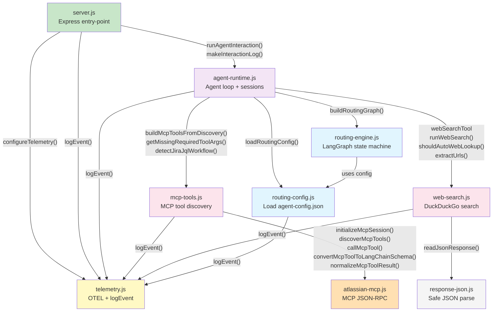

# Implementation

This document describes the high-level implementation decisions for the AI Copilot project.

## Table of Contents

1. [Stack](#stack)
2. [Project Layout](#project-layout)
3. [Frontend Architecture](#frontend-architecture)
4. [Backend Architecture](#backend-architecture)
5. [Backend Module Interactions](#backend-module-interactions)
6. [Styling](#styling)
7. [Routing](#routing)
8. [Data Flow](#data-flow)

## Stack

- **Frontend**: React 19, TypeScript, Vite
- **Backend**: Node.js, Express, LangGraph
- **LLM Orchestration**: LangChain, LangGraph
- **LLM Provider**: OpenAI/OpenRouter
- **Routing**: React Router DOM v7
- **Styling**: Plain CSS variables, no CSS framework
- **Testing**: Playwright (e2e tests)
- **Observability**: OpenTelemetry (OTEL)
- **Tracing Exporters**: Console, OTLP HTTP

## Project Layout

```
src/
  components/
    ChatbotPage.tsx     # Main chat interface
    EntryPage.tsx       # Agent selection screen
  resources/
    agent-config.json   # Agent routing configuration
  types/
    agent.ts            # TypeScript type definitions
  App.tsx               # Root component with routing
  App.css               # Application-level styles
  index.css             # Global styles and CSS variables
  main.tsx              # Entry point

agent-api/
  server.js             # Entry point: Express app, middleware, routes, server start
  telemetry.js          # OTEL provider setup, structured logging, global fetch wrapping
  routing-config.js     # Load and normalise agent-config.json at startup
  routing-engine.js     # LangGraph state machine: intent detection → agent selection
  mcp-tools.js          # MCP tool discovery, LangChain adapters, JQL workflow detection
  web-search.js         # DuckDuckGo search, URL extraction, auto-lookup heuristic
  agent-runtime.js      # Session store, token helpers, full agent interaction loop
  atlassian-mcp.js      # Low-level MCP JSON-RPC calls (initialize, tools/list, tools/call)
  response-json.js      # Safe async JSON body parser

documentation/          # Architecture and implementation docs
requirements/           # Feature requirement documents
tests/                  # Playwright e2e tests
```

### Backend Module Responsibilities

| Module | Lines | Responsibility |
|---|---|---|
| `server.js` | ~95 | Express app, CORS/JSON middleware, route handlers, server start |
| `telemetry.js` | ~216 | OTEL tracer provider, structured `logEvent()`, outbound fetch instrumentation |
| `routing-config.js` | ~207 | Read `agent-config.json`, resolve env-var references, expose typed config |
| `routing-engine.js` | ~104 | LangGraph graph: `intent_router` + `select_agent` nodes |
| `mcp-tools.js` | ~167 | Discover MCP tools, build LangChain wrappers, detect Jira JQL workflow |
| `web-search.js` | ~193 | DuckDuckGo instant-answer search, `webSearchTool`, `shouldAutoWebLookup` |
| `agent-runtime.js` | ~675 | Per-session history, agent loop (up to 5 steps), response assembly |
| `atlassian-mcp.js` | ~174 | MCP JSON-RPC: `initialize`, `tools/list`, `tools/call`, schema normalisation |
| `response-json.js` | ~31 | Reads HTTP response body and safely parses JSON |

## Frontend Architecture

The frontend is a single-page application (SPA) built with React and TypeScript:

- **Entry Point**: `src/main.tsx` mounts React to DOM
- **Root Component**: `src/App.tsx` defines routing and layout
- **Pages**: ChatbotPage and EntryPage components handle UI screens
- **Styling**: CSS variables in `index.css` define design tokens (colors, spacing, fonts)
- **Build Tool**: Vite for fast dev server and optimized production builds

### Component Hierarchy

- App (routing context)
  - EntryPage (agent selector)
  - ChatbotPage (main chat interface)

## Backend Architecture

The backend is a modular Express server with LangGraph for multi-agent orchestration. Each concern lives in a dedicated module; `server.js` is a thin composition entry-point.

- **Framework**: Express.js with CORS and JSON middleware
- **Orchestration**: LangGraph (state machine) built in `routing-engine.js` from config loaded by `routing-config.js`
- **Session Management**: In-memory `Map` in `agent-runtime.js` keyed by `sessionId`
- **Observability**: OpenTelemetry (OTEL) initialised in `server.js` via `configureTelemetry()` from `telemetry.js`
- **Configuration**: Agent routing rules and per-agent `llm-config` loaded from `src/resources/agent-config.json`

### Request Flow

1. `server.js` receives `POST /agent-api { sessionId, userPrompt }`, validates with Zod, delegates to `runAgentInteraction()` in `agent-runtime.js`
2. `agent-runtime.js` invokes the routing graph (from `routing-engine.js`) which calls `computeAtlassianIntent()` and selects the target agent
3. If Atlassian agent is selected: `buildMcpToolsFromDiscovery()` in `mcp-tools.js` connects to the MCP server via `atlassian-mcp.js` and returns LangChain-wrapped tools
4. If orchestrator is selected: `web-search.js` provides the `webSearchTool` and optionally pre-fetches web context via `shouldAutoWebLookup()`
5. `agent-runtime.js` runs an agentic loop (max 5 steps): invokes the LLM, dispatches tool calls, collects results, and assembles the final response
6. Response includes `agentResponse`, `tokenUsage`, structured `logs`, and `costs`
7. Frontend displays response and maintains session history

## Backend Module Interactions

The diagram below shows how the backend modules depend on and call each other at runtime.



**Key flows**:
- `server.js` initialises OTEL once at startup and owns only the HTTP boundary
- `agent-runtime.js` is the orchestration hub — it wires routing, tools, LLM, and session storage
- `telemetry.js` is a shared leaf imported by all modules that emit logs; it has no upstream dependencies inside the project
- `routing-config.js` and `response-json.js` are also pure leaves with no circular dependencies

## Styling

- **Design System**: CSS variables in `index.css` define all colors, spacing, and typography
- **Dark Theme**: All UI uses dark color palette for accessibility
- **No Framework**: Plain CSS for small bundle size and full control
- **Responsive**: Media queries for mobile/tablet/desktop layouts
- **Accessibility**: Semantic HTML and WCAG-compliant contrast ratios

## Routing

Routes are defined in `src/App.tsx` using React Router DOM:

| Path          | Screen                    | Purpose                      |
|---------------|---------------------------|------------------------------|
| `/`           | EntryPage                 | Agent selection screen       |
| `/chatbot`    | ChatbotPage               | Main multi-agent chat        |
| `*`           | Redirect to `/`           | Handle unknown routes        |

## Data Flow

### Chat Message Flow

```
User Input
    ↓
Frontend validates input
    ↓
POST /agent-api { sessionId, userPrompt }
    ↓
Backend loads agent config
    ↓
Evaluate delegation rules (regex → keywords → semantic)
    ↓
Route Decision
    ├─ Specialist Match (e.g., Atlassian keywords detected)?
    │   ├─ YES → Route to Atlassian Agent
    │   │   ├─ Connect to MCP server (Jira/Confluence API)
    │   │   ├─ Execute specialized query
    │   │   └─ Return real-time data
    │   └─ NO → Continue
    │
    └─ Route to Orchestrator Agent
        ↓
        Orchestrator decides:
        ├─ Needs web search? → Perform web search, return current info
        ├─ Should delegate to specialist? → Route to appropriate agent
        └─ Can answer directly? → Answer from training data
        ↓
        Inform user of action taken:
        - "Searching the web..."
        - "Checking your Jira workspace..."
        - Direct response
    ↓
LangGraph executes agent workflow
    ↓
Invoke LLM with agent-specific system prompt
    ↓
Parse LLM response
    ↓
Return { agentResponse, tokenUsage, logs, traceparent, ... }
    ↓
Frontend displays response with clear context
    ↓
Update session history
```

### Orchestrator Agent Decision Table

| Request Type | Action | User Message | Example |
|---|---|---|---|
| **Atlassian Topic** | Delegates (if not already routed) | "Let me check your Jira workspace..." | "What tickets are assigned to me?" |
| **Current Info Needed** | Web Search | "Searching the web for current information..." | "What's the latest news about AI?" |
| **General Knowledge** | Direct Response | Immediate answer | "What is Python?" |
| **Ambiguous** | Ask for Clarification | "I can help with... or..." | "Tell me about projects" |

### Session Management

- **Session ID**: Unique identifier provided by frontend
- **Storage**: In-memory Map (lost on server restart)
- **Message History**: Maintained per session for LLM context
- **Lifetime**: Session persists for duration of server uptime
- **Delegation Trail**: Logs show which agents handled each message
